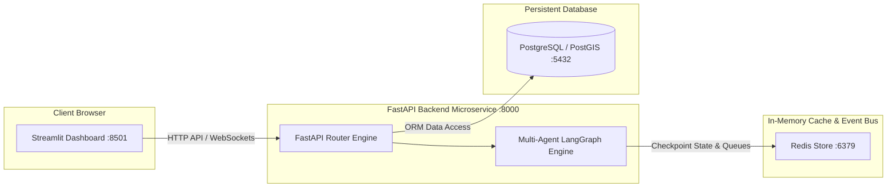
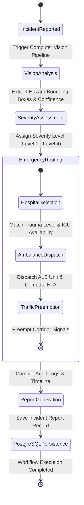
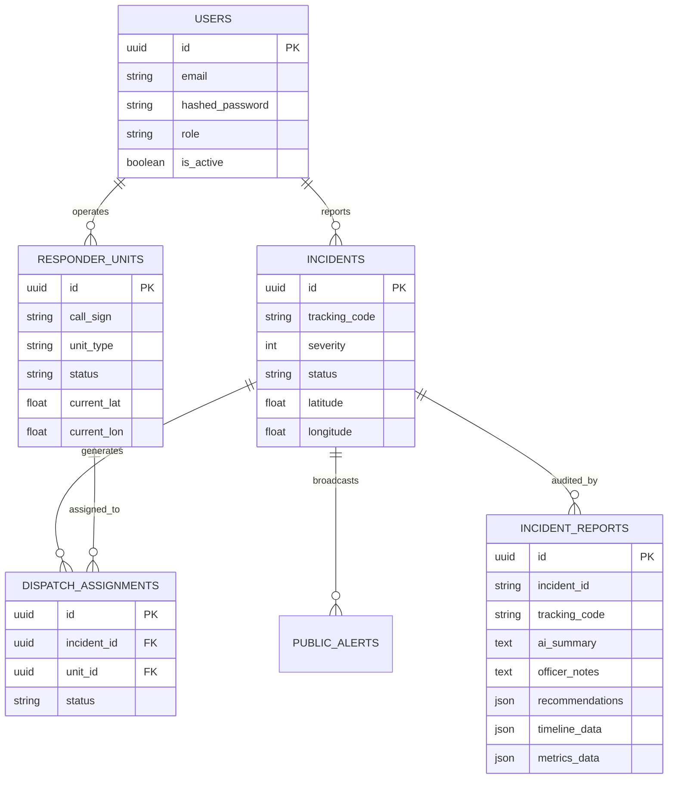

# Technical System Architecture & Multi-Agent Specifications

This document outlines the detailed system architecture, multi-agent workflow state machine, data models, and component interactions of the **AI Emergency Response System (EOC Command Center)**.

---

## 1. High-Level Microservice Topology

The application is structured into 4 decoupled microservice containers managed by Docker Compose:

---

## 2. Multi-Agent Triage & Dispatch Workflow State Machine

The emergency dispatch execution graph is governed by LangGraph. Each node represents a specialized AI agent or deterministic decision module:

---

## 3. Data Models & Entity Relationship Diagram (ERD)

---

## 4. Multi-Agent Domain Responsibilities

1. **Supervisor Agent**: Central coordinator managing execution graph state, node transitions, and human-in-the-loop overrides.
2. **Vision Agent**: Processes camera feeds/images via YOLOv11 & heuristic fallback to detect vehicle fires, structural damage, rollover collisions, and chemical vapor clouds.
3. **Severity Agent**: Evaluates victim counts, hazard tags, and spatial density to assign triage severity levels (Level 1 Critical to Level 4 Minor).
4. **Hospital Agent**: Queries regional trauma center network, matches patient injury specialties (Burn, Neuro, Trauma), and reserves ICU beds.
5. **Ambulance Agent**: Computes optimal fleet unit dispatch based on proximity, unit capabilities (ALS, BLS, Hazmat), and ETA.
6. **Traffic Agent**: Preempts traffic signals along the ambulance transit corridor.
7. **Report Agent**: Synthesizes execution logs into formal post-incident reports with AI executive summaries and recommendations.

---

## 5. Security & Resilience Architecture

- **Authentication & RBAC**: JWT access tokens + 7-day refresh tokens signed with HS256 algorithm. Role permissions matrix enforced across API endpoints and Streamlit views (**Admin**, **Police**, **Hospital**, **Dispatcher**, **Viewer**).
- **Offline Resilience**: All Streamlit views and API Service Clients incorporate resilient fallback modes. If backend APIs or WebSockets are disconnected, the system operates seamlessly using local mock data and HTTP polling fallback with zero UI crashes.
